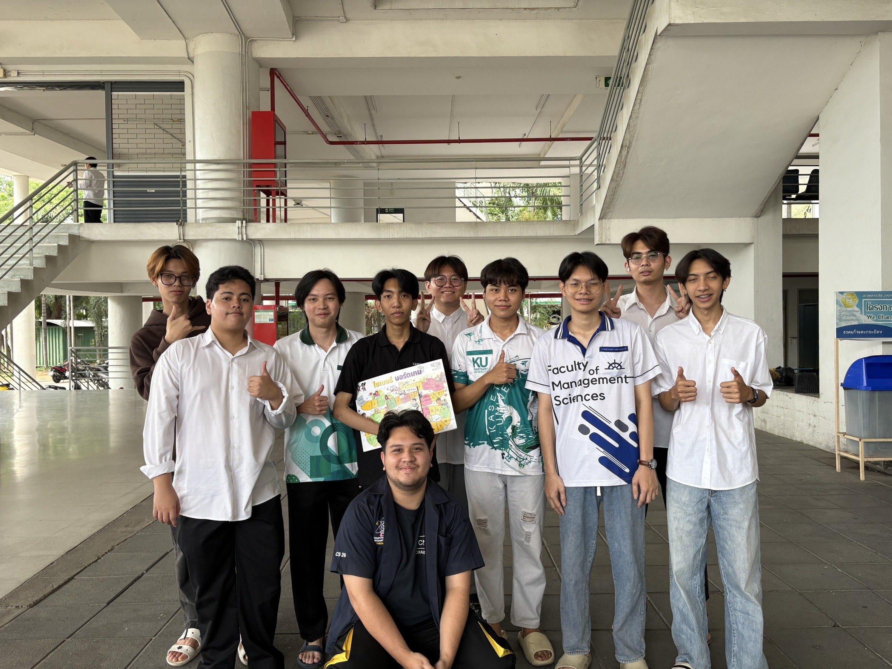

# Board Game Activity

จัดโดยสำนักงานคณะกรรมการการรักษาความมั่นคงปลอดภัยไซเบอร์แห่งชาติ (สกมช. หรือ NCSA)

บอร์ดเกมถูกออกแบบให้ผสมผสานความรู้ด้านความปลอดภัยทางไซเบอร์กับความสนุกสนาน โดยผู้เล่นจะได้เรียนรู้วิธีป้องกันภัยออนไลน์ ฝึกทักษะการรับมือกับสถานการณ์จริง และเสริมสร้างพฤติกรรมที่ปลอดภัยบนโลกดิจิทัลผ่านการเล่นเกมแบบอินเทอร์แอคทีฟ

## วันที่ทำกิจกรรม
####  วันเสาร์ ที่ 8 มีนาคม 2568

## รายละเอียดของกิจกรรม

กิจกรรมนี้จัดทำโดยกลุ่ม **“ Smek Nah Moan ”**
นิสิต คณะวิทยาศาสตร์ ศรีราชา สาขาวิทยาการคอมพิวเตอร์

กิจกรรมนี้เป็นการเล่น **Board Game** ที่ให้ความรู้การป้องกันทางไซเบอร์
ซึ่งเป็นของสำนักงานคณะกรรมการการรักษาความมั่นคงปลอดภัยไซเบอร์แห่งชาติ (สกมช. หรือ NCSA)

## จุดประสงค์ของกิจกรรม
เสริมสร้างความรู้และความเข้าใจเกี่ยวกับภัยคุกคามทางไซเบอร์ให้แก่นักเรียน นักศึกษา และประชาชนทั่วไป ผ่านการเรียนรู้แบบสนุกสนานและมีส่วนร่วม

## ผู้เล่นที่เข้าร่วมกิจกรรม
- คนในกลุ่ม "Smek Nah Moan" 3 คน
- นิสิตคณะการเงิน

# บรรยากาศภายในการทำกิจกรรมการเล่นบอร์ดเกม

#### Video

[⬆️ ⬆️ ⬆️ Cilck เลย ⬆️ ⬆️ ⬆️](https://www.youtube.com/watch?v=jSjYxhDBHN0)
## สมาชิกภายในกลุ่ม

1. [Hannarong Supapun](https://deldel-p.github.io)

2. [Krit Chanthim](https://6530250000.github.io)

3. [Phrommin Kingmahasombat](https://phrommin.github.io)

4. [Phurin Phuangmadue](https://teamgamer11.github.io)

5. [Poothripatn Smithbenjapol](https://poohri5551.github.io)

6. [Punyavee Somboonranee](https://punyavee0.github.io)

7. [Sorravit Meephol](https://sorravitmp.github.io)

8. [Thirawat Siripanich](https://captainnn3.github.io)
